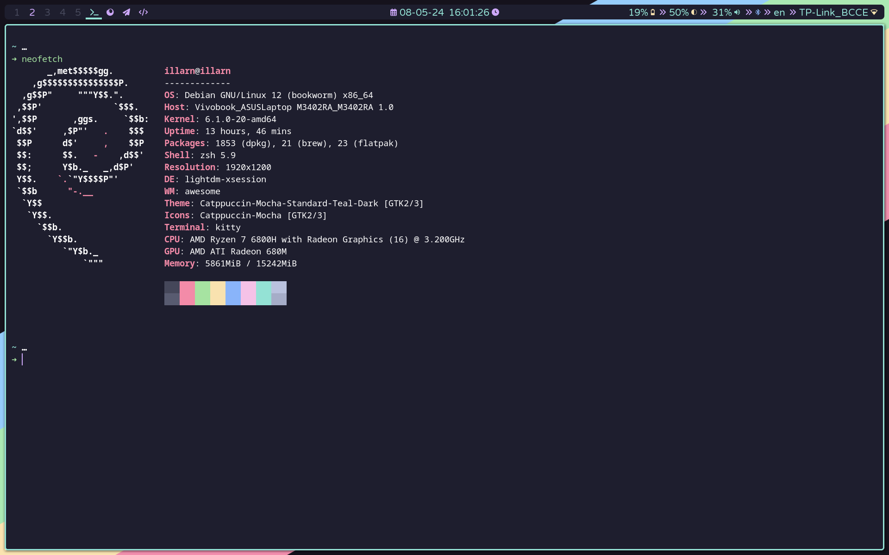
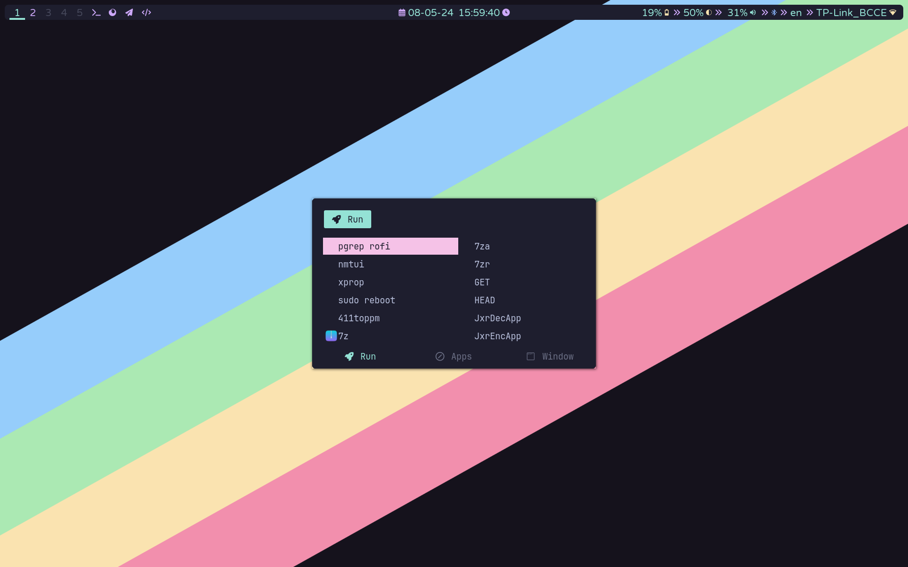
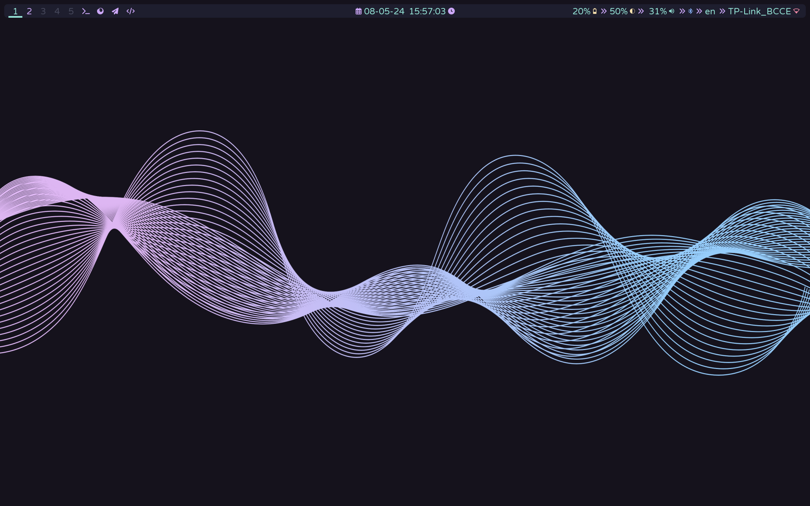

# My dotfiles

## Links

[Rofi theme](https://github.com/catppuccin/rofi) I based mine on

[Repo](https://github.com/Gingeh/wallpapers) I took wallpapers from and changed background color

[Catppuccin gtk](https://github.com/catppuccin/gtk)

[Catppuccin qt](https://github.com/catppuccin/qt5ct)

